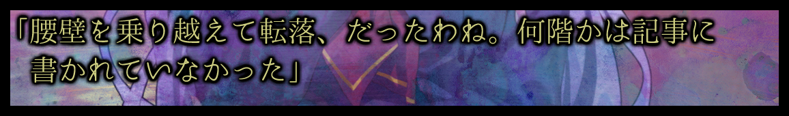
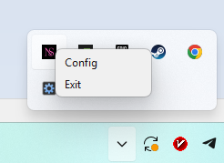

# novella_square
Tool for capturing Japanese/English text from visual novels and copying it to clipboard.



Ctrl+V:
「腰壁を乗り越えて転落、だったわね。 何階かは記事に 書かれていなかった」

## Main features
 - Modern and pretty accurate model PP-OCRv5_mobile [link to read more](https://github.com/PADDLEPADDLE/PADDLEOCR)
 - Simple interface.
 - Just get text in clipboard without translate.
 - Japanese, English recognize.

## Install
#### power shell (recommended)
```irm https://github.com/GVA-error/novella_square/raw/main/install.ps1 | iex```
#### cmd
```powershell -NoProfile -ExecutionPolicy Bypass -Command "iex (iwr https://github.com/GVA-error/novella_square/raw/main/install.ps1).Content"```

## Uninstall
#### power shell (recommended)
```irm https://github.com/GVA-error/novella_square/raw/main/uninstall.ps1 | iex```
#### cmd
```powershell -NoProfile -ExecutionPolicy Bypass -Command "iex (iwr https://github.com/GVA-error/novella_square/raw/main/uninstall.ps1).Content"```

## How to control it
Controls (overlay window):
 - LMB: resize capture area
 - RMB: move capture area
 - click right button tray icon to exit
 - 
